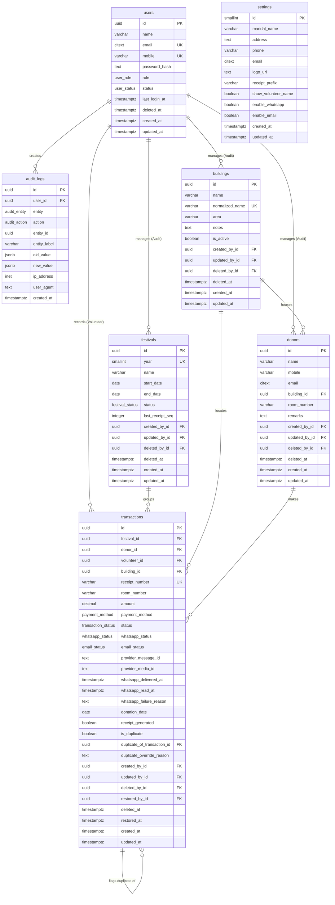
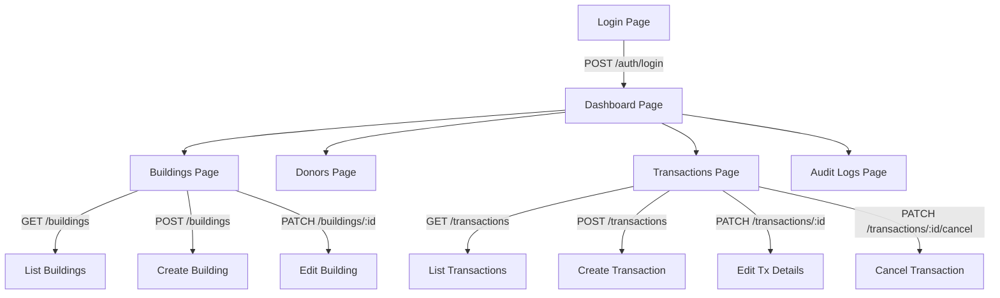

# Ganpati Vargani Collection Management System — Backend API Documentation

Welcome to the official developer documentation for the **Ganpati Vargani Collection Management System** backend. This system acts as the centralized ledger and processing engine for mandal collection cycles (Vargani), resolving donor records, recording financial receipts, rendering PDF receipts, and dispatching receipt communications via the Meta WhatsApp Cloud API.

This document is designed to serve as a complete, comprehensive integration reference for both human engineers and AI frontend generators (such as Bolt, Lovable, v0, and Claude) to build, test, and run a frontend application against this API without having to inspect the backend source code.

---

## Table of Contents
1. [Project Overview](#project-overview)
2. [System Architecture](#system-architecture)
3. [Folder Structure](#folder-structure)
4. [Authentication & Authorization](#authentication--authorization)
5. [Environment Variables](#environment-variables)
6. [Database Documentation](#database-documentation)
7. [API Response Format](#api-response-format)
8. [API Endpoint Documentation](#api-endpoint-documentation)
9. [Module Implementations](#module-implementations)
   - [Building Module](#building-module)
   - [Donor Module (Internal)](#donor-module-internal)
   - [Transaction Module](#transaction-module)
   - [Receipt Module](#receipt-module)
   - [WhatsApp Module](#whatsapp-module)
10. [Middleware](#middleware)
11. [Validation](#validation)
12. [Logging](#logging)
13. [Error Handling](#error-handling)
14. [Frontend Integration Guide](#frontend-integration-guide)
15. [Dashboard Requirements](#dashboard-requirements)
16. [Analytics](#analytics)
17. [Frontend State Management](#frontend-state-management)
18. [Sequence Diagrams / Complete User Flow](#complete-user-flow)
19. [Deployment Guide](#deployment)
20. [Known Limitations & Gaps](#known-limitations)
21. [Future Improvements](#future-improvements)

---

## Project Overview

### What this Backend Does
This backend acts as a highly robust ledger for collecting donations ("Vargani") during the yearly Ganpati festival. The system's primary functions are:
* **Tenant & User Provisioning:** Managing volunteers and administrators who execute and track collections.
* **Building Directory Management:** Maintaining a normalized, searchable master list of residential buildings/societies where donations occur.
* **Smart Donor Management (Implicit):** Resolving donor identities (linking name, mobile, and room details) automatically as a side effect of entering transactions.
* **Transaction Recording & Guardrails:** Tracking individual collection events, assigning serialized receipt numbers, and preventing accidental double-collections for a room within a single year.
* **Automated PDF Receipt Rendering:** Generating formatted PDF receipts immediately after transactions are successfully saved.
* **WhatsApp Receipt Dispatch:** Uploading generated PDFs and sending them as documents to the donor's normalized phone number via the Meta Graph/WhatsApp Cloud API.
* **Delivery Status Synchronization:** Receiving delivery callbacks from Meta webhooks to mark receipts as `SENT`, `DELIVERED`, or `READ`.
* **Activity Auditing:** Storing immutable, append-only logs of auth, user, building, and transaction actions to audit operator activity.

### Business Purpose
Manual receipt generation and door-to-door cash collection during major Indian festivals are prone to human error, double-collection, delayed reporting, and lost receipts. This system digitizes the workflow, allowing volunteers to record transactions on their mobile devices at the donor's door and trigger instant WhatsApp receipts.

### Technology Stack
* **Runtime Environment:** Node.js (TypeScript)
* **Web Framework:** Express.js (v5.x)
* **Database Client (ORM):** Prisma Client (v7.x) with `@prisma/adapter-pg` serverless PostgreSQL adapter
* **Database Engine:** PostgreSQL (hosted on Neon or local instance)
* **PDF Engine:** Headless Puppeteer (launches local browser, parses HTML/CSS to PDF)
* **HTTP Client:** Axios (for Meta Graph API requests)
* **Logging Framework:** Winston (console logs mapped to structured JSON in production)
* **Object Validation:** Zod
* **Security & Utility Libraries:** Helmet, CORS, Compression, bcrypt (password hashing), jsonwebtoken (auth tokens), form-data (media upload requests)

### Design Patterns Used
* **Layered Clean Architecture:** The application splits responsibilities strictly between:
  1. **Route Layer:** Express routes validate incoming payloads and bind parameters.
  2. **Controller Layer:** Extract inputs, handle Express request/response lifecycle, and delegate execution to the Service Layer.
  3. **Service Layer:** Houses the core business rules, transaction boundaries, and coordinates side effects (receipt creation, WhatsApp upload).
  4. **Repository Layer:** Decoupled database operations via Prisma, isolating raw query logic from business rules.
* **Dependency Injection (DI):** Services and controllers use constructor-based dependency injection (or default instances) to decouple layers, enabling straightforward mock testing.
* **Database Audit Hook/Service:** A centralized Audit Service records changes to major tables (`created`, `updated`, `deleted`, `cancelled`) in a transaction-safe manner.

---

## System Architecture

The following sequence illustrates the flow of a client request through the application stack, including database transactions, asynchronous receipt creation, media uploads, and delivery callbacks.

```mermaid
graph TD
  Client[Frontend Client] -->|HTTP Request| Express[Express App]
  
  subgraph Express API Container
    Express -->|Log Request| ReqLog[Request Logger Middleware]
    ReqLog -->|Verify JWT| Auth[Auth Middleware]
    Auth -->|Validate Input| Val[Validation Middleware]
    Val -->|Route Request| Router[Router Module]
    
    Router -->|Dispatch| Controller[Controllers]
    Controller -->|Invoke Business Logic| Service[Services]
    Service -->|Database Queries| Repo[Repositories]
  end

  subgraph Persistence & Generation
    Repo -->|Prisma Client| DB[(PostgreSQL)]
    Service -->|Render HTML/CSS| Template[Receipt Templates]
    Service -->|Launch Headless Chrome| Puppeteer[Puppeteer PDF Gen]
  end

  subgraph External Integrations
    Service -->|Axios POST| Meta[Meta Graph Cloud API]
    WebhookReceiver[Webhook Route] <--|Delivery Status Callback| Meta
    WebhookReceiver -->|Update Status| DB
  end
  
  classDef ext fill:#f9f,stroke:#333,stroke-width:2px;
  class Meta ext;
```

---

## Folder Structure

The backend source code is arranged in a modular structure to enforce clear separation of concerns.

```text
backend/
├── coverage/                 # Jest test coverage reports
├── dist/                     # Compiled JavaScript assets
├── docs/                     # Additional architectural docs
├── prisma/
│   ├── migrations/           # Auto-generated SQL migration files
│   └── schema.prisma         # Database definition file
├── src/
│   ├── app.ts                # Express application configuration
│   ├── server.ts             # Process startup & graceful shutdown handlers
│   ├── config/               # Schema-validated environment config & constants
│   ├── database/             # Prisma client connection setup
│   ├── middleware/           # Express middlewares (error, logger, validation)
│   ├── modules/              # Feature modules containing controllers/services
│   │   ├── audit/            # Immutable operator audit logger
│   │   ├── auth/             # JWT auth, registration, and user utilities
│   │   ├── buildings/        # Building list CRUD
│   │   ├── dashboard/        # Admin summary, payment split, and recent list
│   │   ├── donors/           # Donor registry (internal find-or-create logic)
│   │   ├── festivals/        # Yearly collections record (internal sequence manager)
│   │   ├── messaging/        # WhatsApp sender client, templates, and webhook handlers
│   │   ├── receipt/          # HTML-to-PDF template parsing and compilation
│   │   └── transactions/     # Donation ledger entries, duplicate guardrails
│   ├── shared/               # Shared validators, custom API errors, and responses
│   └── utils/                # Global helper functions (asyncHandler)
└── tests/                    # Integration and unit tests
```

### Folder Responsibilities & Why They Exist
* **`src/config/`**: Centralizes configuration variables, ensuring that missing configurations are caught at startup rather than in production.
* **`src/database/`**: Configures the PostgreSQL adapter for serverless deployments.
* **`src/middleware/`**: Handles error catching, validation, and request logging.
* **`src/modules/`**: Organizes feature code into self-contained modules.
* **`src/shared/`**: Contains common validation schemas, error formats, and API response templates.

---

## Authentication & Authorization

Authentication is stateless and managed via JSON Web Tokens (JWT).

### JWT Flow
1. The client submits user credentials to `/api/v1/auth/login`.
2. On success, the server signs a JWT containing the user's `userId`, `email`, and `role`.
3. The token is returned in the response body.
4. The client must store this token in local memory (or Secure Storage) and attach it to the `Authorization` header of all protected requests:
   `Authorization: Bearer <accessToken>`

### JWT Configuration
* **JWT Secret:** Extracted from `JWT_SECRET` (Must be a cryptographically strong string of at least 32 characters).
* **JWT Expiry:** Configurable via `JWT_EXPIRES_IN` (Defaults to `7d` if omitted).

### Roles & Gatekeeping
The system implements Role-Based Access Control (RBAC) via the `UserRole` enum:
1. **VOLUNTEER:** Can view buildings, record new transactions, edit non-financial fields, and view profiles.
2. **ADMIN:** Has full super-user privileges. Only admins can register new users, soft-delete or restore buildings, cancel transactions, view dashboard statistics, and inspect audit logs.

### Middlewares
* `authenticate`: Checks the presence of the `Authorization` header, extracts the bearer token, verifies it, and attaches the payload to `req.user`.
* `requireRole(...roles)`: Gates access to specific roles. (e.g. `requireRole(UserRole.ADMIN)` restricts route access to administrators).

> [!WARNING]
> **Refresh Tokens are NOT implemented.**
> Although a `COOKIE_MAX_AGE` constant is present in the codebase (configured for a 1-day cookie), there is no database-backed refresh token logic. Re-authentication is required once the access token expires.

---

## Environment Variables

The backend requires the following configuration keys to start up. If any of these are missing or do not match their Zod validation rules at boot time, the application will print validation errors and immediately crash (`process.exit(1)`).

| Variable | Type / Constraints | Default Value | Description |
| :--- | :--- | :--- | :--- |
| `NODE_ENV` | `development` \| `production` \| `test` | `development` | The execution context. Affects logging styles and database print logs. |
| `PORT` | Number | `5000` | The port Express will listen on. |
| `DATABASE_URL` | String (Connection URL) | *Required* | Neon PostgreSQL or local database connection URL. |
| `JWT_SECRET` | String (Min 32 characters) | *Required* | Secret key used to sign and verify access tokens. |
| `JWT_EXPIRES_IN` | String (e.g. `1h`, `7d`) | `7d` | Access token validation window. |
| `BCRYPT_SALT_ROUNDS`| Number | `12` | Hashing work factor for user passwords. |
| `CLIENT_URL` | String (URL) | *Required* | URL of the frontend client. Configures CORS origin policies. |
| `API_VERSION` | String | `v1` | Used in root endpoint indicators. |
| `WHATSAPP_ENABLED` | Boolean (`true` \| `false`) | *Required* | Toggle switch. If false, sending receipts is skipped. |
| `WHATSAPP_API_VERSION`| String (e.g. `v19.0`) | *Required* | Meta Cloud API version to make graph requests. |
| `WHATSAPP_ACCESS_TOKEN`| String | *Required* | Permanent System User access token from Meta Dashboard. |
| `WHATSAPP_PHONE_NUMBER_ID`| String | *Required* | Identifier of the sending WhatsApp business phone number. |
| `WHATSAPP_BUSINESS_ACCOUNT_ID`| String | *Required* | Meta WhatsApp Business Manager Account ID. |
| `WHATSAPP_VERIFY_TOKEN`| String | *Required* | Token entered in Meta developer portal to verify webhooks. |
| `WHATSAPP_DEFAULT_COUNTRY_CODE`| String (e.g. `91`) | *Required* | Country code prepended to 10-digit mobile numbers. |
| `WHATSAPP_TIMEOUT` | Number (Milliseconds) | *Required* | Timeout parameter for Meta API requests. |

---

## Database Documentation

The database is built on PostgreSQL. To bypass Prisma's lack of native check constraints, custom SQL statements are applied via migrations to implement checks like `amount > 0`.

### Entity-Relationship Diagram



### Models & Schema Detail

#### 1. User
Represents administrators and volunteers.
* `id` (UUID, Primary Key, Default: random)
* `name` (VARCHAR(150), Required)
* `email` (Case-insensitive CITEXT, Unique, Required)
* `mobile` (VARCHAR(15), Unique, Required)
* `passwordHash` (TEXT, Required) - BCRYPT hash.
* `role` (UserRole Enum: `ADMIN`, `VOLUNTEER`, Default: `VOLUNTEER`)
* `status` (UserStatus Enum: `ACTIVE`, `INACTIVE`, `SUSPENDED`, Default: `ACTIVE`)
* `lastLoginAt` (TIMESTAMPTZ, Nullable)
* `deletedAt` (TIMESTAMPTZ, Nullable) - Soft-delete timestamp.
* `createdAt` (TIMESTAMPTZ, Default: now)
* `updatedAt` (TIMESTAMPTZ, Auto-updated)
* **Indexes:** Index on `status`, Index on `role`.

#### 2. Festival
Holds metadata for one yearly donation collection cycle.
* `id` (UUID, Primary Key, Default: random)
* `year` (SMALLINT, Unique, Required) - Year (e.g. 2026).
* `name` (VARCHAR(150), Required) - (e.g. "Ganpati Vargani 2026").
* `startDate` (DATE, Required)
* `endDate` (DATE, Required)
* `status` (FestivalStatus Enum: `DRAFT`, `ACTIVE`, `CLOSED`, `ARCHIVED`, Default: `DRAFT`)
* `lastReceiptSeq` (INTEGER, Default: 0) - Tracks the running sequence number for receipt generation.
* `createdById` (UUID, Foreign Key, Restrict)
* `updatedById` (UUID, Foreign Key, Nullable, SetNull)
* `deletedById` (UUID, Foreign Key, Nullable, SetNull)
* `deletedAt` (TIMESTAMPTZ, Nullable)
* `createdAt` / `updatedAt`
* **Indexes:** Index on `status`.

#### 3. Building
Normalized directory of physical locations.
* `id` (UUID, Primary Key, Default: random)
* `name` (VARCHAR(200), Required) - (e.g. "Shivaji Heights B Wing")
* `normalizedName` (VARCHAR(200), Unique, Required) - Uniform, lowercase name to prevent duplicate entries (e.g. "shivajiheightsbwing").
* `area` (VARCHAR(150), Nullable)
* `notes` (TEXT, Nullable)
* `isActive` (BOOLEAN, Default: true)
* `createdById` (UUID, Foreign Key)
* `updatedById` (UUID, Foreign Key, Nullable)
* `deletedById` (UUID, Foreign Key, Nullable)
* `deletedAt` (TIMESTAMPTZ, Nullable)
* `createdAt` / `updatedAt`

#### 4. Donor
Contacts and locations of individuals who have donated.
* `id` (UUID, Primary Key, Default: random)
* `name` (VARCHAR(150), Required)
* `mobile` (VARCHAR(15), Required)
* `email` (CITEXT, Nullable)
* `buildingId` (UUID, Foreign Key, Restrict)
* `roomNumber` (VARCHAR(20), Required)
* `remarks` (TEXT, Nullable)
* `createdById` (UUID, Foreign Key, Restrict)
* `updatedById` (UUID, Foreign Key, Nullable, SetNull)
* `deletedById` (UUID, Foreign Key, Nullable, SetNull)
* `deletedAt` (TIMESTAMPTZ, Nullable)
* `createdAt` / `updatedAt`
* **Constraints:** Unique index `uq_donors_mobile_building_room` (`mobile`, `buildingId`, `roomNumber`).
* **Indexes:**
  * Index on `mobile`.
  * Index on `buildingId` + `roomNumber`.
  * GIN Trigram index `idx_donors_name_trgm` on `name` using `gin_trgm_ops` (enables lightning-fast fuzzy name matches).

#### 5. Transaction
The central table tracking donations.
* `id` (UUID, Primary Key, Default: random)
* `festivalId` (UUID, Foreign Key, Restrict)
* `donorId` (UUID, Foreign Key, Restrict)
* `volunteerId` (UUID, Foreign Key, Restrict) - Volunteer who collected it.
* `buildingId` (UUID, Foreign Key, Restrict)
* `receiptNumber` (VARCHAR(20), Required) - Serialized value (e.g. "2026-000001").
* `roomNumber` (VARCHAR(20), Required) - Saved directly here to avoid deep relational lookups.
* `amount` (DECIMAL(12,2), Required) - Must be greater than 0.
* `paymentMethod` (PaymentMethod Enum: `CASH`, `UPI`, `CARD`, `BANK_TRANSFER`, `CHEQUE`, `OTHER`)
* `status` (TransactionStatus Enum: `PENDING`, `CONFIRMED`, `CANCELLED`, `REFUNDED`, Default: `CONFIRMED`)
* `whatsappStatus` (WhatsappStatus Enum, Default: `PENDING`)
  * `NOT_SENT`, `QUEUED`, `PENDING`, `SENT`, `DELIVERED`, `READ`, `FAILED`, `SKIPPED`
* `emailStatus` (EmailStatus Enum, Default: `NOT_SENT`)
* `providerMessageId` (TEXT, Nullable) - The message identifier returned by WhatsApp.
* `providerMediaId` (TEXT, Nullable) - The media attachment identifier returned by WhatsApp.
* `whatsappDeliveredAt` / `whatsappReadAt` (TIMESTAMPTZ, Nullable)
* `whatsappFailureReason` (TEXT, Nullable)
* `donationDate` (DATE, Default: current date)
* `receiptGenerated` (BOOLEAN, Default: false)
* `isDuplicate` (BOOLEAN, Default: false)
* `duplicateOfTransactionId` (UUID, Foreign Key, Self-Reference, SetNull)
* `duplicateOverrideReason` (TEXT, Nullable)
* `createdById` / `updatedById` / `deletedById` / `restoredById` (UUIDs, Foreign Keys)
* `deletedAt` / `restoredAt` (TIMESTAMPTZ, Nullable)
* `createdAt` / `updatedAt`
* **Constraints:** Unique index `uq_transactions_festival_receipt` (`festivalId`, `receiptNumber`).
* **Indexes:**
  * Index on `receiptNumber`.
  * Index on `festivalId` + `buildingId` + `roomNumber` (checks for room double-donations).
  * Index on `festivalId` + `donationDate`.
  * Index on `volunteerId` + `festivalId`.
  * Index on `donorId`.
  * Index on `buildingId` + `festivalId`.
  * Index on `festivalId` + `paymentMethod`.
  * Index on `status`.
  * Index on `festivalId` + `whatsappStatus`.
  * Index on `festivalId` + `emailStatus`.
  * Index on `createdAt`.

#### 6. Settings
Config variables for the mandal.
* `id` (SMALLINT, Primary Key, Default: 1) - Restricts settings to a single row.
* `mandalName` (VARCHAR(200), Required)
* `address` (TEXT, Nullable)
* `phone` (VARCHAR(15), Nullable)
* `email` (CITEXT, Nullable)
* `logoUrl` (TEXT, Nullable)
* `receiptPrefix` (VARCHAR(20), Default: "")
* `showVolunteerName` (BOOLEAN, Default: true)
* `enableWhatsapp` (BOOLEAN, Default: true)
* `enableEmail` (BOOLEAN, Default: true)
* `createdAt` / `updatedAt`

> [!IMPORTANT]
> The `Settings` table has **no active CRUD endpoints** in this backend. Its structure is defined in schema.prisma, but settings are not queried or updated by the API controllers.

#### 7. AuditLog
An append-only activity ledger.
* `id` (UUID, Primary Key, Default: random)
* `userId` (UUID, Foreign Key, SetNull) - User who performed the action.
* `entity` (AuditEntity Enum: `AUTH`, `BUILDING`, `TRANSACTION`, `SETTINGS`, `USER`)
* `action` (AuditAction Enum: `CREATE`, `UPDATE`, `DELETE`, `LOGIN`, `LOGOUT`, `EXPORT`, `RECEIPT_REGENERATE`, `STATUS_CHANGE`)
* `entityId` (UUID, Nullable) - Primary key of the targeted row.
* `entityLabel` (VARCHAR(255), Nullable) - Human-readable label (e.g. building name, receipt number).
* `oldValue` (JSONB, Nullable) - Record state before modification.
* `newValue` (JSONB, Nullable) - Record state after modification.
* `ipAddress` (INET, Nullable)
* `userAgent` (TEXT, Nullable)
* `createdAt` (TIMESTAMPTZ, Default: now)
* **Indexes:** Index on `entity` + `entityId`, Index on `entityLabel`, Index on `action`, Index on `userId` + `createdAt`.

---

## API Response Format

The API formats all responses using a consistent structure for easier parsing by the frontend client.

### Success Response Envelope
Returned for standard success payloads (status code `200` or `201`).
```json
{
  "success": true,
  "message": "Buildings fetched successfully",
  "data": { ... },
  "meta": {
    "page": 1,
    "limit": 10,
    "total": 23,
    "totalPages": 3
  }
}
```

### Error Response Envelope
Returned when an operational or system error occurs (status codes `400`, `401`, `403`, `404`, `409`, `500`).
```json
{
  "success": false,
  "message": "Unauthorized access attempt"
}
```

### Validation Error Response Envelope
Returned for invalid inputs (status code `422`).
```json
{
  "success": false,
  "message": "Validation failed",
  "errors": {
    "mobile": [
      "Enter a valid 10-digit mobile number"
    ],
    "amount": [
      "Amount must be greater than 0"
    ]
  }
}
```

---

## API Endpoint Documentation

Base URI: `http://localhost:5000/api/v1`

### 1. Authentication Router

#### Authenticate User (Login)
* **Method:** `POST`
* **Route:** `/auth/login`
* **Auth Required:** No
* **Request Body:**
  ```json
  {
    "email": "admin@vargani.com",
    "password": "Password123"
  }
  ```
* **Validation Rules:** `email` must be a valid format; `password` is required.
* **Success Response (200 OK):**
  ```json
  {
    "success": true,
    "message": "Login successful",
    "data": {
      "user": {
        "id": "23a1a9e8-b80c-4fa2-bc4b-8e10260278bb",
        "name": "Super Admin",
        "email": "admin@vargani.com",
        "mobile": "9876543210",
        "role": "ADMIN",
        "status": "ACTIVE",
        "lastLoginAt": "2026-07-30T02:00:00.000Z",
        "createdAt": "2026-07-29T10:00:00.000Z",
        "updatedAt": "2026-07-30T02:00:00.000Z"
      },
      "accessToken": "eyJhbGciOiJIUzI1NiIsIn..."
    }
  }
  ```
* **Errors:**
  * `401 Unauthorized` (e.g. `"Invalid email or password"` or `"Your account is suspended"`)
  * `422 Unprocessable Entity` (Validation failed)

#### Register User
* **Method:** `POST`
* **Route:** `/auth/register`
* **Auth Required:** Yes (Role: `ADMIN` only)
* **Request Body:**
  ```json
  {
    "name": "Vijay Kumar",
    "email": "vijay@vargani.com",
    "mobile": "9820098200",
    "password": "StrongPassword99",
    "role": "VOLUNTEER"
  }
  ```
* **Validation Rules:**
  * `name`: Trimmed, 2 to 100 characters.
  * `email`: Valid format.
  * `mobile`: Must match pattern `/^[6-9]\d{9}$/` (10-digit India mobile).
  * `password`: Min 8 characters, containing at least 1 lowercase letter, 1 uppercase letter, and 1 number.
  * `role`: String enum (`ADMIN` | `VOLUNTEER`). Defaults to `VOLUNTEER`.
* **Success Response (201 Created):**
  ```json
  {
    "success": true,
    "message": "User registered successfully",
    "data": {
      "id": "402eb0e5-7977-4d7a-af17-48f1ea8e05c2",
      "name": "Vijay Kumar",
      "email": "vijay@vargani.com",
      "mobile": "9820098200",
      "role": "VOLUNTEER",
      "status": "ACTIVE",
      "createdAt": "2026-07-30T02:10:00.000Z",
      "updatedAt": "2026-07-30T02:10:00.000Z"
    }
  }
  ```
* **Errors:**
  * `401 Unauthorized` (Token expired or missing)
  * `403 Forbidden` (User is a volunteer and cannot register users)
  * `409 Conflict` (Email or Mobile number is already taken)
  * `422 Unprocessable Entity` (Invalid format or weak password)

#### Get Current Profile
* **Method:** `GET`
* **Route:** `/auth/me`
* **Auth Required:** Yes (Any Role)
* **Success Response (200 OK):**
  ```json
  {
    "success": true,
    "message": "Profile fetched successfully",
    "data": {
      "id": "402eb0e5-7977-4d7a-af17-48f1ea8e05c2",
      "name": "Vijay Kumar",
      "email": "vijay@vargani.com",
      "mobile": "9820098200",
      "role": "VOLUNTEER",
      "status": "ACTIVE"
    }
  }
  ```

#### Logout User
* **Method:** `POST`
* **Route:** `/auth/logout`
* **Auth Required:** Yes (Any Role)
* **Success Response (200 OK):**
  ```json
  {
    "success": true,
    "message": "Logout successful",
    "data": null
  }
  ```

---

### 2. Building Router

#### Create Building
* **Method:** `POST`
* **Route:** `/buildings`
* **Auth Required:** Yes (Roles: `ADMIN`, `VOLUNTEER`)
* **Request Body:**
  ```json
  {
    "name": "Gokuldham Society A Wing",
    "area": "Goregaon East",
    "notes": "Opposite Film City gate"
  }
  ```
* **Validation Rules:**
  * `name`: Min 2, max 150 characters.
  * `area`: Max 150 characters (optional).
  * `notes`: Max 1000 characters (optional).
* **Success Response (201 Created):**
  ```json
  {
    "success": true,
    "message": "Building created successfully",
    "data": {
      "id": "e932b13c-7bf0-41fa-9b43-4e4b868e4ee0",
      "name": "Gokuldham Society A Wing",
      "normalizedName": "gokuldhamsocietyawing",
      "area": "Goregaon East",
      "notes": "Opposite Film City gate",
      "isActive": true,
      "createdById": "23a1a9e8-b80c-4fa2-bc4b-8e10260278bb",
      "updatedById": null,
      "deletedById": null,
      "deletedAt": null,
      "createdAt": "2026-07-30T02:15:00.000Z",
      "updatedAt": "2026-07-30T02:15:00.000Z"
    }
  }
  ```
* **Errors:**
  * `409 Conflict` (A building with this normalized name already exists)

#### List Buildings (Paginated)
* **Method:** `GET`
* **Route:** `/buildings`
* **Auth Required:** Yes (Any Role)
* **Query Params:**
  * `page` (Number, Default: 1)
  * `limit` (Number, Default: 10)
  * `search` (String, Optional) - Matches name (case-insensitive)
  * `sortBy` (Enum: `name` \| `createdAt` \| `updatedAt`, Default: `name`)
  * `sortOrder` (Enum: `asc` \| `desc`, Default: `asc`)
* **Success Response (200 OK):**
  ```json
  {
    "success": true,
    "message": "Buildings fetched successfully",
    "data": {
      "data": [
        {
          "id": "e932b13c-7bf0-41fa-9b43-4e4b868e4ee0",
          "name": "Gokuldham Society A Wing",
          "normalizedName": "gokuldhamsocietyawing",
          "area": "Goregaon East",
          "notes": "Opposite Film City gate",
          "isActive": true,
          "createdAt": "2026-07-30T02:15:00.000Z"
        }
      ],
      "pagination": {
        "page": 1,
        "limit": 10,
        "total": 1,
        "totalPages": 1
      }
    }
  }
  ```

#### Get Building by ID
* **Method:** `GET`
* **Route:** `/buildings/:id`
* **Auth Required:** Yes (Any Role)
* **Params:** `id` (UUID format)
* **Success Response (200 OK):**
  ```json
  {
    "success": true,
    "message": "Building fetched successfully",
    "data": { ...buildingDetails... }
  }
  ```

#### Update Building
* **Method:** `PATCH`
* **Route:** `/buildings/:id`
* **Auth Required:** Yes (Roles: `ADMIN`, `VOLUNTEER`)
* **Params:** `id` (UUID format)
* **Request Body:** (At least one field is required)
  ```json
  {
    "name": "Gokuldham Co-op Society A Wing",
    "area": "Goregaon West"
  }
  ```
* **Success Response (200 OK):**
  ```json
  {
    "success": true,
    "message": "Building updated successfully",
    "data": { ...updatedBuildingDetails... }
  }
  ```
* **Errors:**
  * `409 Conflict` (New name clashes with another building's normalized name)

#### Delete Building (Soft Delete)
* **Method:** `DELETE`
* **Route:** `/buildings/:id`
* **Auth Required:** Yes (Role: `ADMIN` only)
* **Params:** `id` (UUID format)
* **Constraints:** The operation will fail with `400 Bad Request` if the building is linked to one or more active donor profiles.
* **Success Response (200 OK):**
  ```json
  {
    "success": true,
    "message": "Building deleted successfully",
    "data": {
      "id": "e932b13c-7bf0-41fa-9b43-4e4b868e4ee0",
      "name": "Gokuldham Society A Wing",
      "deletedById": "23a1a9e8-b80c-4fa2-bc4b-8e10260278bb",
      "deletedAt": "2026-07-30T02:20:00.000Z"
    }
  }
  ```

#### Restore Building
* **Method:** `PATCH`
* **Route:** `/buildings/:id/restore`
* **Auth Required:** Yes (Role: `ADMIN` only)
* **Params:** `id` (UUID format)
* **Success Response (200 OK):**
  ```json
  {
    "success": true,
    "message": "Building restored successfully",
    "data": null
  }
  ```

---

### 3. Transaction Router

#### Record Donation Transaction
* **Method:** `POST`
* **Route:** `/transactions`
* **Auth Required:** Yes (Roles: `ADMIN`, `VOLUNTEER`)
* **Request Body:**
  ```json
  {
    "buildingId": "e932b13c-7bf0-41fa-9b43-4e4b868e4ee0",
    "donorName": "Jethalal Gada",
    "mobile": "9820098200",
    "roomNumber": "101",
    "amount": 2500,
    "paymentMethod": "UPI",
    "year": 2026,
    "overrideDuplicate": false
  }
  ```
  *(Note: You can pass `buildingNormalizedName` instead of `buildingId` if the ID is unknown to the frontend. The server's pre-controller middleware will automatically lookup and map the building).*
* **Validation Rules:**
  * `buildingId` (UUID) or `buildingNormalizedName` (String) must be provided.
  * `amount`: Number, must be between `1` and `1,00,000`.
  * `mobile`: Must match `/^[6-9]\d{9}$/`.
  * `paymentMethod`: Enum (`CASH` \| `UPI` \| `CARD` \| `BANK_TRANSFER` \| `CHEQUE` \| `OTHER`).
  * `overrideDuplicate`: Boolean (optional, defaults to `false`).
  * `duplicateOverrideReason`: String, required and must be 5 to 300 characters long only if `overrideDuplicate` is `true`.
* **Flow & Side Effects:**
  1. Compares room details to prevent duplicate donation entries within the same year. If a duplicate matches, it throws a `409 Conflict` (unless overridden with a reason).
  2. Creates the transaction and donor inside a single database transaction block.
  3. Increments the receipt sequence number for the festival year and generates a receipt number (e.g. `2026-000001`).
  4. Generates a PDF receipt using Puppeteer.
  5. Uploads the receipt to Meta and requests WhatsApp delivery.
* **Success Response (201 Created):**
  ```json
  {
    "success": true,
    "message": "Transaction recorded successfully",
    "data": {
      "id": "b9687cd7-cbfe-4b13-ba19-5eb76e6b8c9c",
      "festivalId": "1b08c6a2-6f3b-48ae-94a2-7fa345c22880",
      "donorId": "87c9bcda-3f41-4773-8b7a-92e1b123acde",
      "volunteerId": "23a1a9e8-b80c-4fa2-bc4b-8e10260278bb",
      "buildingId": "e932b13c-7bf0-41fa-9b43-4e4b868e4ee0",
      "receiptNumber": "2026-000001",
      "roomNumber": "101",
      "amount": "2500.00",
      "paymentMethod": "UPI",
      "status": "CONFIRMED",
      "whatsappStatus": "SENT",
      "emailStatus": "NOT_SENT",
      "providerMessageId": "wamid.HBgLOTE5ODIwMDk4MjAwFQIAERgSQjE4MzY3QzJBNEMzQTA1QzQ1AA==",
      "providerMediaId": "502938491029384",
      "donationDate": "2026-07-30T00:00:00.000Z",
      "receiptGenerated": true,
      "isDuplicate": false,
      "createdAt": "2026-07-30T02:25:00.000Z"
    }
  }
  ```
* **Errors:**
  * `409 Conflict` (e.g., room collection already recorded: `"A donation for this room has already been recorded for this festival..."`)
  * `422 Unprocessable Entity` (Validation failed)

#### List Transactions (Paginated)
* **Method:** `GET`
* **Route:** `/transactions`
* **Auth Required:** Yes (Any Role)
* **Query Params:**
  * `page` (Number, Default: 1)
  * `limit` (Number, Default: 20)
  * `search` (String, Optional) - Matches `receiptNumber`, `donor.name`, or `donor.mobile`
  * `paymentMethod` (Enum: `CASH`, `UPI` etc., Optional)
  * `status` (Enum: `PENDING`, `CONFIRMED` etc., Optional)
  * `year` (Number, Optional)
  * `fromDate` (Date String, Optional)
  * `toDate` (Date String, Optional)
  * `sortBy` (Enum: `donationDate` \| `amount` \| `createdAt` \| `receiptNumber`, Default: `donationDate`)
  * `sortOrder` (Enum: `asc` \| `desc`, Default: `desc`)
* **Success Response (200 OK):**
  ```json
  {
    "success": true,
    "message": "Transactions fetched successfully",
    "data": {
      "data": [
        {
          "id": "b9687cd7-cbfe-4b13-ba19-5eb76e6b8c9c",
          "receiptNumber": "2026-000001",
          "roomNumber": "101",
          "amount": "2500.00",
          "paymentMethod": "UPI",
          "status": "CONFIRMED",
          "whatsappStatus": "SENT",
          "donationDate": "2026-07-30T00:00:00.000Z",
          "createdAt": "2026-07-30T02:25:00.000Z",
          "donor": {
            "id": "87c9bcda-3f41-4773-8b7a-92e1b123acde",
            "name": "Jethalal Gada",
            "mobile": "9820098200",
            "roomNumber": "101"
          },
          "building": {
            "id": "e932b13c-7bf0-41fa-9b43-4e4b868e4ee0",
            "name": "Gokuldham Society A Wing"
          }
        }
      ],
      "pagination": {
        "page": 1,
        "limit": 20,
        "total": 1,
        "totalPages": 1
      }
    }
  }
  ```

#### Get Transaction by ID
* **Method:** `GET`
* **Route:** `/transactions/:id`
* **Auth Required:** Yes (Any Role)
* **Params:** `id` (UUID format)
* **Success Response (200 OK):**
  ```json
  {
    "success": true,
    "message": "Transaction fetched successfully",
    "data": { ...transactionDetailsIncludingDonorAndBuilding... }
  }
  ```

#### Update Transaction (Fields Restricting Guard)
* **Method:** `PATCH`
* **Route:** `/transactions/:id`
* **Auth Required:** Yes (Roles: `ADMIN`, `VOLUNTEER`)
* **Params:** `id` (UUID format)
* **Request Body:**
  ```json
  {
    "donorName": "Jethalal Champaklal Gada",
    "roomNumber": "101-A"
  }
  ```
* **Validation Rules:**
  * Only `donorName` and `roomNumber` can be updated. Financial or audit fields (`amount`, `paymentMethod`, `buildingId`, `mobile`, `receiptNumber`) are locked. Updating these values requires cancelling the transaction and recording a new one.
* **Success Response (200 OK):**
  ```json
  {
    "success": true,
    "message": "Transaction updated successfully",
    "data": { ...updatedTransactionDetails... }
  }
  ```

#### Cancel Transaction
* **Method:** `PATCH`
* **Route:** `/transactions/:id/cancel`
* **Auth Required:** Yes (Role: `ADMIN` only)
* **Params:** `id` (UUID format)
* **Success Response (200 OK):**
  ```json
  {
    "success": true,
    "message": "Transaction cancelled successfully",
    "data": {
      "id": "b9687cd7-cbfe-4b13-ba19-5eb76e6b8c9c",
      "receiptNumber": "2026-000001",
      "status": "CANCELLED"
    }
  }
  ```
* **Errors:**
  * `400 Bad Request` (Transaction is already cancelled)

---

### 4. Dashboard Router

#### Get Dashboard Summary Metrics
* **Method:** `GET`
* **Route:** `/dashboard`
* **Auth Required:** Yes (Role: `ADMIN` only)
* **Query Params:** Must be empty. Any query parameter triggers a `422 Unprocessable Entity` error.
* **Success Response (200 OK):**
  ```json
  {
    "success": true,
    "message": "Dashboard data fetched successfully",
    "data": {
      "summary": {
        "todayCollection": 2500,
        "transactionsToday": 1,
        "monthCollection": 45000,
        "yearCollection": 1500000,
        "totalTransactions": 680,
        "averageDonation": 2205.88,
        "highestDonation": 51000
      },
      "paymentDistribution": [
        {
          "mode": "UPI",
          "count": 420,
          "amount": 950000
        },
        {
          "mode": "Cash",
          "count": 260,
          "amount": 550000
        }
      ],
      "recentTransactions": [
        {
          "id": "b9687cd7-cbfe-4b13-ba19-5eb76e6b8c9c",
          "receiptNumber": "2026-000001",
          "donorName": "Jethalal Gada",
          "amount": 2500,
          "paymentMode": "UPI",
          "createdAt": "2026-07-30T02:25:00.000Z",
          "building": {
            "id": "e932b13c-7bf0-41fa-9b43-4e4b868e4ee0",
            "name": "Gokuldham Society A Wing"
          }
        }
      ]
    }
  }
  ```

---

### 5. Audit Log Router

#### List Audit Logs (Paginated)
* **Method:** `GET`
* **Route:** `/audit-logs`
* **Auth Required:** Yes (Role: `ADMIN` only)
* **Query Params:**
  * `page` (Number, Default: 1)
  * `limit` (Number, Default: 20, Max: 100)
  * `search` (String, Optional)
  * `entity` (Enum: `AUTH` \| `BUILDING` \| `TRANSACTION` \| `SETTINGS` \| `USER`, Optional)
  * `action` (Enum: `CREATE` \| `UPDATE` etc., Optional)
  * `userId` (UUID, Optional)
  * `fromDate` (Date String, Optional)
  * `toDate` (Date String, Optional)
  * `sortOrder` (Enum: `asc` \| `desc`, Default: `desc`)
* **Success Response (200 OK):**
  ```json
  {
    "success": true,
    "message": "Audit logs fetched successfully",
    "data": {
      "data": [
        {
          "id": "ea43f9a1-cbde-4c12-ba22-8ea31234bcda",
          "entity": "TRANSACTION",
          "entityId": "b9687cd7-cbfe-4b13-ba19-5eb76e6b8c9c",
          "entityLabel": "2026-000001",
          "action": "CREATE",
          "oldValue": null,
          "newValue": {
            "id": "b9687cd7-cbfe-4b13-ba19-5eb76e6b8c9c",
            "amount": "2500.00"
          },
          "ipAddress": "127.0.0.1",
          "userAgent": "Mozilla/5.0...",
          "createdAt": "2026-07-30T02:25:00.000Z",
          "userId": "23a1a9e8-b80c-4fa2-bc4b-8e10260278bb"
        }
      ],
      "pagination": {
        "page": 1,
        "limit": 20,
        "total": 1,
        "totalPages": 1
      }
    }
  }
  ```

#### Get Audit Log by ID
* **Method:** `GET`
* **Route:** `/audit-logs/:id`
* **Auth Required:** Yes (Role: `ADMIN` only)
* **Params:** `id` (UUID format)
* **Success Response (200 OK):**
  ```json
  {
    "success": true,
    "message": "Audit log fetched successfully",
    "data": { ...auditLogDetails... }
  }
  ```

---

### 6. Meta WhatsApp Webhook Router

#### Verification Webhook
* **Method:** `GET`
* **Route:** `/webhooks/whatsapp`
* **Auth Required:** No
* **Query Params:**
  * `hub.mode` (Must equal `"subscribe"`)
  * `hub.challenge` (Challenge string provided by Meta)
  * `hub.verify_token` (Must match local `WHATSAPP_VERIFY_TOKEN`)
* **Success Response (200 OK):** Sends back the raw `hub.challenge` string.
* **Errors:**
  * `403 Forbidden` (If verify token is incorrect or verify parameters are missing)

#### Delivery Status Webhook Callback
* **Method:** `POST`
* **Route:** `/webhooks/whatsapp`
* **Auth Required:** No
* **Request Body:** Standard Meta Cloud API Status update payload. Refer to the [WhatsApp Module Status Updates](#whatsapp-webhook-status-updates) section for details on the payload structure.
* **Success Response (200 OK):** `200 OK` (Always returned, even if matching transaction is not found, to prevent Meta from retrying and eventually disabling the webhook endpoint).

---

### 7. Receipt Document Router

#### Download / Preview PDF Receipt
* **Method:** `GET`
* **Route:** `/transactions/:transactionId/receipt`
* **Auth Required:** Yes (Any Role)
* **Params:** `transactionId` (UUID format)
* **Success Response (200 OK):** Returns raw PDF buffer.
  * **Headers:**
    * `Content-Type: application/pdf`
    * `Content-Disposition: inline; filename="RECEIPT_NUMBER.pdf"`
* **Errors:**
  * `404 Not Found` (Transaction not found)
  * `500 Internal Server Error` (Failed to generate PDF receipt)

> [!IMPORTANT]
> The receipt endpoint is implemented in `receipt.routes.ts` and `receipt.controller.ts`, but it is **not mounted** in the main `routes/index.ts` express router. To access this route, it must be explicitly mounted (e.g. `router.use('/', receiptRoutes)`).

---

## Module Implementations

### Building Module
* **Responsibilities:** Create, update, soft delete, and restore buildings.
* **Fuzzy Uniqueness Check:** To prevent duplicate building entries (such as "Shivaji Heights Wing A" and "shivaji heights wing a"), building names are passed through the `normalizeBuildingName` helper. This helper:
  1. Strips all whitespace characters.
  2. Removes special characters, punctuation, and hyphens.
  3. Converts characters to lowercase.
  4. Example: `"Co-op, Shivaji Heights — Wing B"` becomes `"coopshivajiheightswingb"`.
  When a building is created or updated, the system checks the database for normalized name duplicates.
* **Soft Delete Logic:** Instead of hard-deleting records, the system marks the building as inactive by setting the `deletedAt` and `deletedById` columns. 
* **Deletion Block Constraint:** Before deleting a building, the system checks if the building is linked to any donor profiles (even soft-deleted ones). If links exist, deletion is aborted (`400 Bad Request` - `"Building cannot be deleted because it is associated with donors."`).

### Donor Module (Internal)
* **No Standalone CRUD APIs:** The Donor entity does not expose independent endpoints. Donors cannot be created, listed, or edited directly.
* **Automatic Creation:** Resolving donors is handled implicitly inside `TransactionService.create`. 
* **Contact Resolution Logic:** When recording a transaction, the service checks for an existing donor matching the composite key `mobile` + `buildingId` + `roomNumber`.
  * If a record exists, the transaction links to it.
  * If no record exists, a new Donor is created.
  * **Constraint:** If a repeat donor visits with a different name spelling (e.g., a family member with the same mobile number), the **existing donor record remains unchanged**. This design prioritizes record integrity over minor text corrections, as the backend lacks a donor reconciliation interface.

### Transaction Module
* **Transaction Lifecycle:** Standard transactions are created with the status `CONFIRMED`. Administrators can update the status to `CANCELLED` (which functions as a soft-delete).
* **Double-Donation Prevention:** During creation, the service runs a query to see if there is an active (non-cancelled) transaction for the same `buildingId` and `roomNumber` within the current festival year.
  * If an active transaction exists, the request is rejected with a `409 Conflict`.
  * To allow the transaction, the volunteer must submit `overrideDuplicate: true` with a `duplicateOverrideReason` (5 to 300 characters). This will link the transaction to the original record via the `duplicateOfTransactionId` field.
* **Sequential Receipt Assignment:** Within the database transaction, the system runs a Postgres row-lock select on the `Festival` table, increments the `lastReceiptSeq` value, and returns the new sequence number. This sequence number is then zero-padded to 6 digits to generate the final receipt number.

```text
Database Transaction Block
├─ Read Festival Row and lock for update
├─ Fetch / Create Donor
├─ Run duplicate check for room
├─ Increment lastReceiptSeq
├─ Save Transaction
└─ Commit
Post-Commit Block (Async)
├─ Generate PDF Receipt
├─ If success -> Set receiptGenerated = true
└─ If WhatsApp active -> Dispatch PDF to Meta Cloud API
```

### Receipt Module
* **HTML Templates:** Layout templates are written in HTML (`receipt.html`) and styled with external CSS (`receipt.css`), using `__ASSETS__` placeholders for images.
* **PDF Compilation:** The system loads the template, injects transaction data variables (such as formatting values and dates), and sends the HTML to a headless Puppeteer browser instance. Puppeteer prints the page to an A4 format PDF buffer with zero margins and background graphics enabled.
* **Amount-to-Words Conversion:** Uses the `to-words` package configured for the `en-IN` locale to translate numbers into words (e.g. `2500` becomes `"Two Thousand Five Hundred Rupees Only"`).
* **Currency Formatting:** Uses `Intl.NumberFormat("en-IN", { style: "currency", currency: "INR" })` to format donation amounts (e.g., `100000` is formatted as `₹ 1,00,000.00`).

### WhatsApp Module

#### Send Message Lifecycle
```text
State: PENDING
  ├── PDF Generation fails ──> State: FAILED
  └── PDF Generation succeeds ──> Update receiptGenerated = true
                                    │
                                    ▼
                             Upload PDF to Meta ──> Success?
                                    │                 ├── No ──> State: FAILED
                                    │                 └── Yes
                                    ▼
                             Send Document Msg ──> Success?
                                                      ├── No ──> State: FAILED
                                                      └── Yes ──> State: SENT (Save providerMessageId)
                                                                    │
                                                                    ▼
                                                            Webhook Status updates
                                                                    ├── delivered ──> State: DELIVERED
                                                                    └── read ──> State: READ
```

#### Phone Number Normalization
Before sending a message, the system strips spaces, hyphens, parentheses, and leading `+` signs. If the number does not start with the country code configured in `WHATSAPP_DEFAULT_COUNTRY_CODE` (typically `91`), the prefix is automatically prepended.

#### Two-Stage Document Transmission
1. **Media Upload:** The PDF buffer is sent to `/phone_number_id/media` via a multipart `POST` request. Meta returns a `mediaId`.
2. **Send Message:** The system sends a JSON payload to `/phone_number_id/messages` containing the recipient's phone number, setting the message type to `document` and referencing the `mediaId`. Meta returns a `messages[0].id` string, which the system stores as the `providerMessageId` to track webhook delivery updates.

#### Webhook Verification
To verify the webhook endpoint, Meta sends a `GET` request containing `hub.mode`, `hub.challenge`, and `hub.verify_token`. The system checks that the verify token matches `WHATSAPP_VERIFY_TOKEN` and returns the challenge string to complete the validation.

#### Webhook Status Updates
Meta reports delivery updates via `POST` callbacks.
* **Payload Structure:**
  ```json
  {
    "object": "whatsapp_business_account",
    "entry": [
      {
        "id": "WHATSAPP_BUSINESS_ACCOUNT_ID",
        "changes": [
          {
            "value": {
              "messaging_product": "whatsapp",
              "metadata": {
                "display_phone_number": "PHONE_NUMBER",
                "phone_number_id": "PHONE_NUMBER_ID"
              },
              "statuses": [
                {
                  "id": "providerMessageId",
                  "status": "sent" | "delivered" | "read" | "failed",
                  "timestamp": "1722288000",
                  "recipient_id": "919820098200",
                  "errors": [
                    {
                      "code": 131042,
                      "title": "Payment required",
                      "message": "Business account has unpaid invoices"
                    }
                  ]
                }
              ]
            },
            "field": "messages"
          }
        ]
      }
    ]
  }
  ```
The webhook handler processes the status update:
1. Looks up the transaction by `providerMessageId`.
2. Maps the incoming Meta status (`sent`, `delivered`, `read`, `failed`) to the corresponding `WhatsappStatus` enum value.
3. Updates the transaction's status columns. If the status is `delivered` or `read`, it converts the Unix timestamp to a PostgreSQL timestamptz value and saves it. If the status is `failed`, it extracts the error code or message and saves it to the `whatsappFailureReason` column.

> [!WARNING]
> **No Automated Retry Logic.**
> If the media upload or document sending fails, the system logs the error to the database and marks the status as `FAILED`. No background retry queues are implemented.

---

## Middleware

The application registers the following global and route-specific Express middlewares:

1. `requestLoggerMiddleware`
   * **Location:** Global application handler.
   * **Purpose:** Starts a timer on request entry. On response completion, calculates latency and logs the request details (`METHOD`, `path`, `statusCode`, `latency`, `IP`, `User-Agent`). Logs errors at `error` level for status codes $\ge 500$, warnings at `warn` level for codes $400-499$, and HTTP events at `http` level for codes $< 400$.
2. `authenticate`
   * **Location:** Route-specific handler.
   * **Purpose:** Decodes the token in the `Authorization: Bearer <token>` header and attaches the payload to `req.user`. Throws an `UnauthorizedError` if the token is missing, invalid, or expired.
3. `requireRole(...allowedRoles)`
   * **Location:** Route-specific handler.
   * **Purpose:** Restricts route access to specific roles (e.g. `requireRole(UserRole.ADMIN)`). Returns a `403 Forbidden` error if the user's role is not authorized.
4. `validate(schema, part = "body")`
   * **Location:** Route-specific handler.
   * **Purpose:** Validates incoming payloads (using `body`, `params`, or `query`) against a Zod schema. If validation succeeds, it writes the validated and coerced values back to the request object. If validation fails, it catches the Zod error, flattens it, and passes a `ValidationError` to the next handler.
5. `notFoundMiddleware`
   * **Location:** Registered after all routes.
   * **Purpose:** Catches requests to unmapped routes and returns a `404 Not Found` error.
6. `errorMiddleware`
   * **Location:** Global application handler.
   * **Purpose:** Central error handler. Translates database errors into custom API errors, logs failures, and returns a formatted JSON error response.

---

## Validation

Input validation is enforced using Zod schemas before requests reach the controllers. This ensures the controllers receive pre-validated, correctly typed data.

### Validation Architecture
```text
Incoming Express Request
       │
       ▼
   validate(zodSchema, "body" | "query" | "params")
       │
 ┌─────┴──────────────┐
Valid?              Invalid?
 │                     │
 ▼                     ▼
Overwrite req.part   ZodError intercepted
with coerced output    │
 & call next()         ▼
                       Flatten error field errors
                       │
                       ▼
                     next(new ValidationError(fieldErrors))
                       │
                       ▼
                     Global Error Middleware (422 response)
```

---

## Logging

Logging is managed using Winston and is configured differently depending on the execution context.

### Development Logger Configuration
* **Transport:** Console.
* **Formatting:** Colorized output formatted as:
  `[YYYY-MM-DD HH:mm:ss] level: message {metadata}`
* **Stack Traces:** Enabled for error levels.

### Production Logger Configuration
* **Transport:** Console (standard stdout).
* **Formatting:** JSON format containing `timestamp`, `level`, `message`, and any contextual `metadata`.
* **Stack Traces:** Errors are logged as JSON objects containing full stack traces to prevent logs from breaking onto multiple lines.

---

## Error Handling

The backend manages errors using a structured hierarchy derived from a base `ApiError` class.

```text
                   Error (Native JS)
                       │
                       ▼
                   ApiError (isOperational: true)
                       │
 ┌─────────────────────┼─────────────────────┐
ValidationError  NotFoundError  UnauthorizedError  ConflictError
(422)            (404)          (401)              (409)
```

* **Operational Errors:** Expected failures (such as validation errors, expired auth tokens, or duplicate entries) set the `isOperational` flag to `true`. This instructs the global handler that the error message is safe to return to the client.
* **System Errors:** Uncaught code exceptions or infrastructure failures (such as database connection losses) default to `isOperational: false`. The global handler logs these as critical errors and returns a generic `"Internal Server Error"` message to prevent leaking system details.

### Database Error Normalization
The error middleware intercepts database exceptions and maps them to clean HTTP responses:
* **P2002 (Unique Constraint Failed):** Returns `409 Conflict` (e.g. `"A record with this field already exists"`).
* **P2025 (Record Not Found):** Returns `404 Not Found` (e.g. `"Requested resource was not found"`).
* **P2003 (Foreign Key Constraint Failed):** Returns `400 Bad Request` (e.g. `"Invalid reference to a related record"`).
* **PrismaClientValidationError:** Returns `400 Bad Request` (e.g. `"Invalid data provided to the database"`).

---

## Frontend Integration Guide

This guide details how to implement frontend pages, map them to backend API endpoints, and handle state management.

### Page-by-Page Integration Map



#### 1. Login Page
* **API Endpoints:** `POST /auth/login`
* **Workflow:**
  1. Capture the email and password inputs.
  2. Display a loading spinner on the submit button.
  3. Send the login request.
  4. On success:
     * Save the `accessToken` and user object to your state manager.
     * Set the `Authorization` header for subsequent API calls.
     * Display a success toast ("Welcome back, {user.name}").
     * Redirect the user to `/dashboard`.
  5. On failure:
     * Clear the password input.
     * Display a toast containing the error message.

#### 2. Admin Dashboard Page
* **API Endpoints:** `GET /dashboard`
* **Access Rules:** Restricted to users with the `ADMIN` role.
* **Workflow:**
  1. Fetch the dashboard data on mount.
  2. If the request fails with a `403 Forbidden` error, display an access denied message and redirect the user.
  3. Map the `summary` metrics to display cards.
  4. Map `paymentDistribution` to render visual charts (e.g., a pie chart of donation payment methods).
  5. Render the `recentTransactions` array in a summary table.

#### 3. Buildings Page (CRUD)
* **API Endpoints:**
  * List: `GET /buildings?page=1&limit=10&search=&sortBy=name&sortOrder=asc`
  * Create: `POST /buildings`
  * Update: `PATCH /buildings/:id`
  * Delete: `DELETE /buildings/:id` (Admin only)
  * Restore: `PATCH /buildings/:id/restore` (Admin only)
* **Workflow:**
  1. Load the paginated list of buildings.
  2. Add a search input that updates the `search` query parameter (debounced by 300ms).
  3. Add table headers to toggle sorting (`sortBy=name`, `sortBy=createdAt` etc.).
  4. **Create Flow:** Open a dialog modal to collect the building's name, area, and notes. On success, show a success toast and refresh the page.
  5. **Delete Flow:** Confirm the deletion with a modal. If the building has active donors, display the returned error message in a toast: `"Building cannot be deleted because it is associated with donors"`.

#### 4. Donors Page
* **API Endpoints:** `GET /transactions` (There is no dedicated donor API).
* **Explanation:** Because the backend manages donors internally, the frontend should simulate the donors page by querying the transactions list.
* **Simulation Recommendation:**
  * To display a donor directory, query `GET /transactions?limit=100` and map the nested `donor` fields in the response list.
  * To view a donor's profile, display the donor object attributes nested within their transaction record.

#### 5. Transactions Ledger Page
* **API Endpoints:**
  * List: `GET /transactions?page=1&limit=20&search=`
  * Create: `POST /transactions`
  * Update: `PATCH /transactions/:id`
  * Cancel: `PATCH /transactions/:id/cancel` (Admin only)
* **Workflow:**
  1. Load the paginated transaction history table.
  2. Add table filters for `paymentMethod`, `status`, and date ranges (`fromDate`/`toDate`).
  3. Include status tags indicating the transaction's WhatsApp status (`PENDING`, `SENT`, `DELIVERED`, `READ`, `FAILED`).
  4. **Create Flow:**
     * Render dropdown lists for buildings and payment methods.
     * Gather the donor's name, room number, mobile, amount, and payment method.
     * Submit the creation request.
     * If the server returns a duplicate error (`409 Conflict`), interrupt the flow and display a prompt: `"A donation for this room has already been recorded. Do you want to save this as a duplicate collection?"`.
     * If the user confirms, submit the request again with `overrideDuplicate: true` and the reason they entered.

#### 6. Analytics Page
* **API Endpoints:** `GET /dashboard`, `GET /transactions`
* **Simulation Recommendation:**
  * There is no dedicated analytics endpoint. Use the `GET /dashboard` metrics to display payment distributions and average donation trends.
  * For advanced analytics (such as tracking daily collection totals over time), fetch the transaction list using `GET /transactions?limit=100` and group the amounts by `donationDate`.

#### 7. Receipts Page
* **API Endpoints:** `GET /transactions/:transactionId/receipt`
* **Workflow:**
  1. When a user clicks "View Receipt", open the endpoint URL in a new browser tab: `/api/v1/transactions/:transactionId/receipt?token=JWT`.
  2. To display a PDF preview modal, fetch the PDF buffer with the authentication header, load the raw binary data, and render it using a library like `pdf.js` or within an `<iframe>`.

#### 8. Settings Page
* **API Endpoints:** None (The settings endpoints are not implemented).
* **Simulation Recommendation:**
  * Render settings controls in the UI (e.g. toggle switches for WhatsApp delivery or custom receipt prefixes).
  * Save these configurations to local storage or application state so the frontend can reference them locally.

#### 9. Profile Page
* **API Endpoints:** `GET /auth/me`
* **Workflow:**
  1. Load the authenticated user's profile details on mount.
  2. Display the user's name, email, mobile number, role, and status.

---

## Dashboard Requirements

The following metrics returned by `GET /dashboard` can be mapped directly to UI cards:

| Card Title | Value path | Notes |
| :--- | :--- | :--- |
| **Total Donations** | `summary.yearCollection` | Displays the total amount collected in the current year. |
| **Today's Donations** | `summary.todayCollection` | Collection total for the current date. |
| **Monthly Collection** | `summary.monthCollection` | Running collection total for the current calendar month. |
| **Transaction Count** | `summary.totalTransactions` | Total number of recorded transaction entries. |
| **Average Donation** | `summary.averageDonation` | Total collection amount divided by the transaction count. |
| **Highest Donation** | `summary.highestDonation` | The largest single donation amount recorded. |

### Supported Charts
* **Payment Split Chart:** Map the `paymentDistribution` array to a Pie, Doughnut, or Bar chart.
  ```json
  [
    { "mode": "UPI", "count": 420, "amount": 950000 },
    { "mode": "Cash", "count": 260, "amount": 550000 }
  ]
  ```

---

## Analytics

The system does not expose a dedicated analytics route. To build analytics views, the frontend should consume the dashboard metrics and query the transactions endpoint:

1. **Active Filter Options:** Query transactions using search strings, payment methods, transaction statuses, and custom date windows (`fromDate` and `toDate`).
2. **Supported Charts:**
   * **Donation Trends:** Fetch transactions sorted by date (`sortBy=donationDate&sortOrder=asc`) and plot the daily collection totals.
   * **Payment Distribution:** Use the payment distribution totals returned by the dashboard endpoint.

---

## Frontend State Management

For a reliable and responsive user experience, we recommend structuring the frontend state as follows:

1. **Server Cache State (React Query / SWR):**
   * Use a query caching library to manage server state for buildings, transactions, and dashboard statistics.
   * Configure a 5-minute stale time for building lists.
   * Set the stale time for dashboard metrics to 1 minute to keep stats fresh.
2. **Global Client State (Zustand / Redux):**
   * Manage global app states, such as the current active festival year, sidebar layouts, theme choices, and dialog open states.
3. **Authentication State:**
   * Save the JWT and user profile details in state.
   * Persist the credentials in secure local storage so session state is maintained across page reloads.
4. **Optimistic Updates:**
   * When a volunteer updates a building's details, update the cache optimistically before the PUT/PATCH request completes to keep the UI feeling fast.

---

## Complete User Flow

The diagram below maps the sequence of events from when a volunteer logs in to record a donation to when the delivery status webhook updates the transaction.

```mermaid
sequenceDiagram
  autonumber
  actor Volunteer as Volunteer Client
  actor Admin as Admin Client
  participant API as Express API Router
  participant DB as PostgreSQL DB
  participant Puppeteer as Puppeteer Engine
  participant Meta as Meta WhatsApp API

  %% Phase 1: Login
  Volunteer->>API: POST /auth/login (email, password)
  API->>DB: Query user where email & status = ACTIVE
  DB-->>API: User details and password hash
  API-->>Volunteer: Return 200 OK + JWT accessToken
  
  %% Phase 2: Transaction Record
  Volunteer->>API: POST /transactions (amount, room, buildingId, mobile, etc.)
  activate API
  API->>DB: Check for active duplicates (same building, room, year)
  DB-->>API: No duplicates found
  
  Note over API,DB: Begin Transaction Block
  API->>DB: Increment lastReceiptSeq on Festival table
  API->>DB: Insert or fetch Donor record
  API->>DB: Save Transaction record (status: CONFIRMED, whatsappStatus: PENDING)
  API->>DB: Write Audit log entry
  Note over API,DB: Commit Transaction
  
  API-->>Volunteer: Return 201 Created (Transaction saved successfully)
  deactivate Volunteer
  
  %% Asynchronous Post-Commit Phase
  Note over API,Puppeteer: Async Receipt Creation
  API->>Puppeteer: Render receipt HTML template to PDF buffer
  Puppeteer-->>API: Return PDF buffer
  API->>DB: Update transaction (receiptGenerated: true)

  Note over API,Meta: Async WhatsApp Dispatch
  API->>Meta: POST /phone_id/media (Upload PDF buffer)
  Meta-->>API: Return mediaId
  API->>Meta: POST /phone_id/messages (Send document referencing mediaId)
  Meta-->>API: Return providerMessageId (wamid)
  API->>DB: Update transaction (whatsappStatus: SENT, providerMessageId: wamid)
  deactivate API

  %% Webhook Callback Phase
  Meta->>API: POST /webhooks/whatsapp (Status event: delivered, timestamp)
  activate API
  API->>DB: Find transaction by providerMessageId
  DB-->>API: Return transaction details
  API->>DB: Update transaction (whatsappStatus: DELIVERED, whatsappDeliveredAt: timestamp)
  API-->>Meta: Return 200 OK
  deactivate API
```

---

## Deployment

### Render Hosting Guide
The backend is configured for deployment to **Render** as a Web Service.

1. **Environment Setup:** Create a Web Service on Render and link it to your GitHub repository.
2. **Environment Variables:** Copy all the keys listed in the [Environment Variables](#environment-variables) section into Render's Environment panel.
3. **Build Command:** Run the install script followed by the build steps.
   `npm install && npm run build`
4. **Start Command:** Run the database migrations followed by starting the node server.
   `npx prisma db push && npm run start`

### Production Server Security Configurations
* **CORS Settings:** The server restricts requests to the origin URL configured in the `CLIENT_URL` environment variable.
* **HTTPS/SSL Security:** In production, the API enforces secure connections. All cookies (such as those reserved for future refresh token implementations) are configured with the `Secure` and `HttpOnly` flags enabled.
* **Chrome Runtime dependency:** Because receipt generation requires launching a headless browser, ensure your Render environment includes the chrome/chromium binary or set the `CHROME_PATH` variable to point to the correct executable path.

---

## Known Limitations

This section documents missing features and limitations in the current backend implementation:

1. **No Standalone CRUD for Donors:** The database contains a `Donor` table, but there are no endpoints (`/donors`) to list, search, or edit donor records directly.
2. **No Settings API:** The database contains a `Settings` table, but there are no backend routes or controllers implemented to view or update these settings.
3. **No Standalone Festival CRUD:** Festivals are resolved and created automatically. There are no routes to create, edit, or archive festival records manually.
4. **Receipt Endpoint is Not Mounted:** The `/transactions/:transactionId/receipt` route is fully implemented but is **not mounted** in `routes/index.ts`.
5. **No Refresh Token Flow:** Session refresh is not implemented. When the access token expires, the user is logged out and must re-authenticate.
6. **No Automated Message Retries:** If WhatsApp delivery fails, the status is updated to `FAILED`. The system does not attempt to resend the message.
7. **No Background Task Queue:** PDF rendering and WhatsApp uploads are run asynchronously post-commit, but they run inside the main Express process. Under heavy traffic, this could lead to memory issues or CPU spikes.
8. **No Cloudinary Integration:** Although the prompt lists Cloudinary, the backend codebase contains no Cloudinary SDK dependencies or media storage integrations. Receipts are generated dynamically and sent directly to Meta without being saved to cloud storage.

---

## Future Improvements

We recommend implementing the following improvements in future releases:

1. **Dedicated Notification Queue:** Offload PDF generation and WhatsApp uploads to a background worker queue (using a library like `BullMQ` backed by Redis) to prevent CPU spikes in the main API process.
2. **Audit Logging for Message Delivery:** Create a dedicated table to log message delivery attempts and callback histories for easier troubleshooting.
3. **Multi-Channel Delivery Providers:** Update `MessagingService` to support alternative delivery channels (such as Twilio SMS or SendGrid Email) if a recipient's WhatsApp number is unavailable.
4. **Idempotent Webhook Processing:** Add an idempotency layer to the webhook processor to ignore duplicate status updates sent by Meta.
5. **Settings and Configuration Admin Panel:** Implement standard REST endpoints (`GET /settings`, `PATCH /settings`) to allow administrators to update mandal settings.
6. **Token Rotation and Refresh:** Implement secure refresh token rotation using HTTP-only cookies.
7. **Receipt Resend Action:** Implement a route (`POST /transactions/:id/resend`) to allow users to trigger a manual receipt retry if the initial WhatsApp delivery failed.