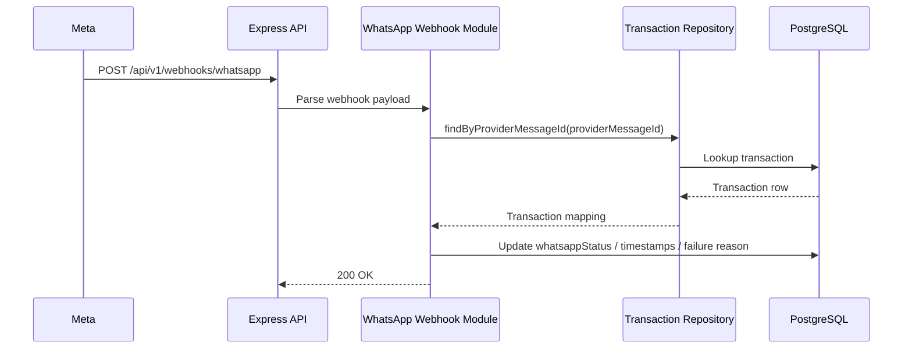

# WhatsApp Webhook Integration

## Architecture



## Verification Flow

Meta verifies the endpoint with a `GET /api/v1/webhooks/whatsapp` request containing `hub.mode`, `hub.challenge`, and `hub.verify_token`.

The server accepts the webhook only when:
- `hub.mode === subscribe`
- `hub.verify_token === WHATSAPP_VERIFY_TOKEN`

## Delivery Lifecycle

- `PENDING`: transaction created, receipt is ready to send.
- `SENT`: WhatsApp document API accepted the message.
- `DELIVERED`: Meta reports delivery.
- `READ`: Meta reports the recipient read the message.
- `FAILED`: WhatsApp send failed or Meta reported a failure.
- `SKIPPED`: messaging is disabled, so no delivery attempt is made.

## Database Updates

The transaction row stores:
- `receiptGenerated`
- `whatsappStatus`
- `providerMessageId`
- `providerMediaId`
- `whatsappDeliveredAt`
- `whatsappReadAt`
- `whatsappFailureReason`

## Message Status Lifecycle

```text
PENDING -> SENT -> DELIVERED -> READ
PENDING -> FAILED
PENDING -> SKIPPED
```

## Future Improvements

- Persist webhook event payloads in an audit table for traceability.
- Add retry-safe idempotency on duplicate webhook deliveries.
- Add tests for verification, delivery mapping, and failure handling.
